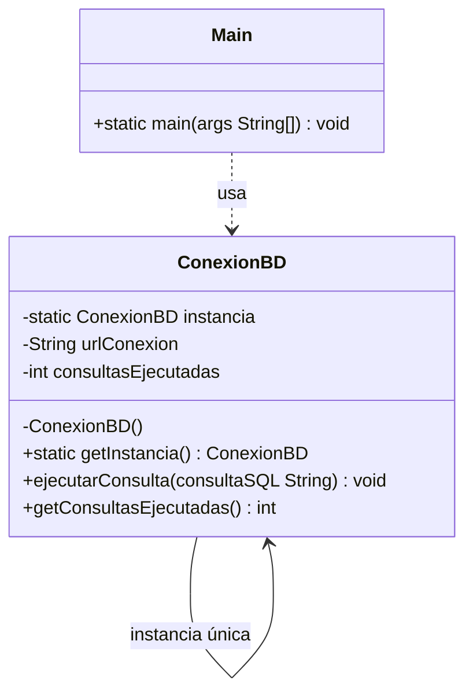
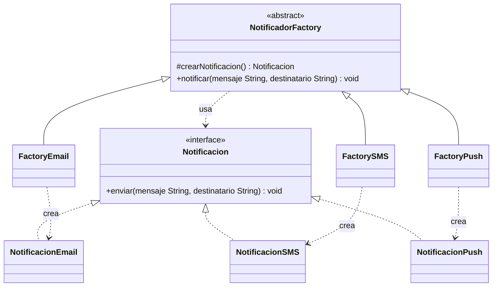
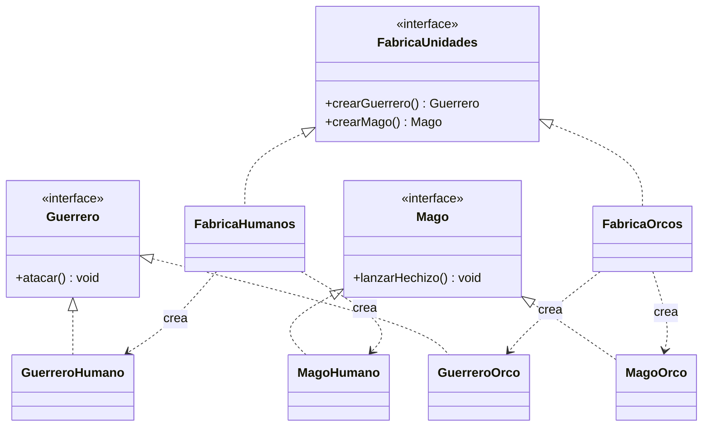
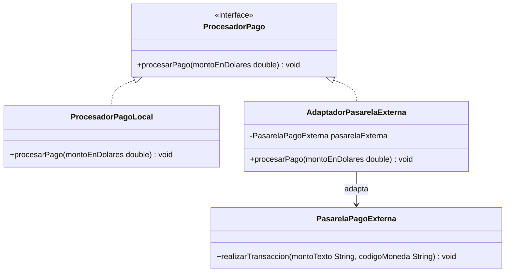
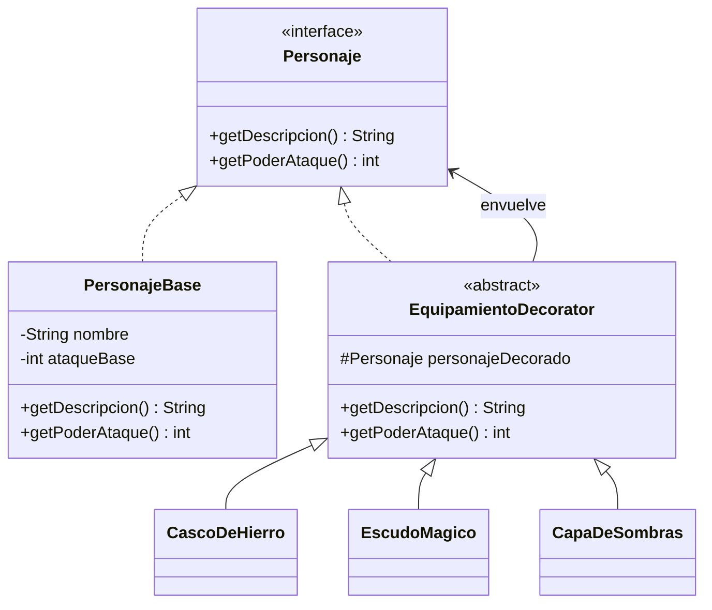
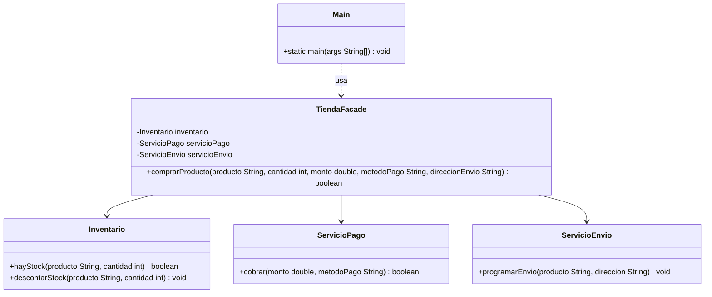

# Informe – Trabajo Práctico N°3: Patrones de Diseño

**Materia:** Programación II
**Profesor:** Ing. Tulio Ruesjas Martín
**Alumno:** _______________________

---

## 1. Singleton — Gestor de Conexión a Base de Datos

### Planteo del escenario
En un **sistema bancario**, toda la aplicación necesita acceder a la misma
base de datos central. Si cada módulo (cuentas, movimientos, préstamos)
creara su propia conexión, se desperdiciarían recursos, se podrían generar
inconsistencias y se perdería el control sobre cuántas conexiones activas
existen en un momento dado.

### Justificación técnica
El patrón **Singleton** es la mejor solución porque garantiza que **exista
una única instancia** de `ConexionBD` en toda la aplicación y provee un
**punto de acceso global** a ella (`getInstancia()`). Se implementó con
**doble verificación de bloqueo** (*double-checked locking*) y la variable
de instancia como `volatile`, de modo que sea segura en entornos
multi-hilo sin pagar el costo de sincronizar en cada llamada.

### Diagrama UML

### Problemas encontrados y solución
El principal riesgo del Singleton es la **concurrencia**: dos hilos podrían
crear dos instancias si el chequeo `if (instancia == null)` no está
protegido. Se resolvió con el patrón *double-checked locking* + `volatile`,
que evita instancias duplicadas y minimiza el uso de `synchronized` (solo
se sincroniza la primera vez que se crea el objeto).

---

## 2. Factory Method — Sistema de Notificaciones de una App de Delivery

### Planteo del escenario
Una app de delivery necesita **notificar a sus clientes** por distintos
canales (Email, SMS, Push) según la preferencia del usuario o el evento
(confirmación de pedido, aviso de envío, etc.). El código que dispara la
notificación no debería tener que conocer ni instanciar directamente cada
clase concreta de notificación.

### Justificación técnica
El patrón **Factory Method** permite que una clase creadora abstracta
(`NotificadorFactory`) delegue la decisión de **qué clase concreta
instanciar** en sus subclases (`FactoryEmail`, `FactorySMS`,
`FactoryPush`), cada una encapsulando la creación de su propio producto.
Esto evita condicionales tipo `if/else` o `switch` dispersos por el
código cada vez que se agrega un nuevo canal, cumpliendo el **principio
abierto/cerrado**: para agregar WhatsApp alcanza con crear una nueva
`Notificacion` y una nueva `Factory`, sin tocar el código existente.

### Diagrama UML

### Problemas encontrados y solución
Al principio se consideró crear las notificaciones con un único método
estático `crear(String tipo)`, pero eso implicaba un `switch` que crecería
con cada canal nuevo (violando el principio abierto/cerrado). Se resolvió
delegando la creación en subclases de `NotificadorFactory`, cada una
responsable de un solo producto.

---

## 3. Abstract Factory — Ejércitos de un Videojuego

### Planteo del escenario
En un videojuego de estrategia existen varias **facciones** (Humanos,
Orcos), y cada una tiene su propia familia de unidades: un `Guerrero` y
un `Mago` con comportamiento distinto. Es fundamental que, al formar un
ejército, **no se mezclen** unidades de distintas facciones (por ejemplo,
un Guerrero Humano junto a un Mago Orco).

### Justificación técnica
El patrón **Abstract Factory** es ideal porque provee una interfaz
(`FabricaUnidades`) para crear **familias completas de objetos
relacionados** (`Guerrero` + `Mago`) sin especificar sus clases concretas.
Cada fábrica concreta (`FabricaHumanos`, `FabricaOrcos`) asegura, por
construcción, que todas las unidades creadas pertenezcan a la misma
facción, evitando incoherencias que un Factory Method simple (que crea un
solo tipo de producto) no podría garantizar.

### Diagrama UML

### Problemas encontrados y solución
El desafío fue distinguir cuándo usar Abstract Factory en lugar de Factory
Method. Se optó por Abstract Factory porque acá se crean **dos productos
relacionados por familia** (Guerrero y Mago de una misma facción), y no
un único producto como en el ejercicio de notificaciones.

---

## 4. Adapter — Integración de una Pasarela de Pago Externa

### Planteo del escenario
Un sistema de e-commerce propio define su propia interfaz de cobro
(`ProcesadorPago.procesarPago(double)`), pero necesita integrar el SDK de
una **pasarela de pagos externa** (`PasarelaPagoExterna`) cuya firma de
método es incompatible: recibe el monto como `String` y exige un código
de moneda en cada llamada. No se puede modificar el SDK de terceros.

### Justificación técnica
El patrón **Adapter** permite reutilizar la clase existente
`PasarelaPagoExterna` **sin modificarla**, envolviéndola en
`AdaptadorPasarelaExterna`, que implementa la interfaz `ProcesadorPago`
esperada por el sistema y traduce internamente la llamada (convierte el
`double` a `String` y agrega el código de moneda "USD"). Así, el resto de
la aplicación puede tratar el procesador propio y el externo de forma
**uniforme**, a través de la misma interfaz.

### Diagrama UML

### Problemas encontrados y solución
La dificultad fue decidir la conversión de formatos entre ambas interfaces
(`double` → `String`, y de dónde tomar el código de moneda). Se resolvió
fijando "USD" dentro del adaptador como valor por defecto del sistema,
manteniendo la traducción encapsulada exclusivamente en esa clase.

---

## 5. Decorator — Equipamiento de un Personaje de RPG

### Planteo del escenario
En un videojuego de rol, un personaje puede equiparse con distintos
ítems (casco, escudo, capa) que modifican sus estadísticas (poder de
ataque) y su descripción. La cantidad de combinaciones posibles de
equipamiento es muy grande, por lo que crear una subclase para cada
combinación (`GuerreroConCascoYEscudo`, `GuerreroConCapaYCasco`, etc.)
sería inmanejable.

### Justificación técnica
El patrón **Decorator** permite **agregar responsabilidades a un objeto
dinámicamente**, envolviéndolo en decoradores (`CascoDeHierro`,
`EscudoMagico`, `CapaDeSombras`) que implementan la misma interfaz
(`Personaje`) que el componente base. Cada decorador delega en el objeto
que envuelve y le suma su propio efecto, permitiendo **combinar
equipamiento libremente en tiempo de ejecución** sin explosión de
subclases.

### Diagrama UML

### Problemas encontrados y solución
El punto delicado fue asegurar que cada decorador **delegue primero** en
el objeto envuelto (`super.getPoderAtaque()`) y luego sume su propio
aporte, en vez de reemplazar el valor. Esto garantiza que los efectos de
múltiples decoradores apilados se **acumulen correctamente** sin importar
el orden en que se coloquen.

---

## 6. Facade — Proceso de Compra de una Tienda Online

### Planteo del escenario
Completar una compra en una tienda online involucra coordinar varios
subsistemas independientes: verificar y descontar **stock**
(`Inventario`), **cobrar** el pedido (`ServicioPago`) y **programar el
envío** (`ServicioEnvio`). Si el cliente de la aplicación tuviera que
invocar cada uno de estos subsistemas en el orden correcto, el código
cliente sería complejo y propenso a errores.

### Justificación técnica
El patrón **Facade** resuelve esto ofreciendo una interfaz única y
simplificada (`TiendaFacade.comprarProducto(...)`) que **oculta la
complejidad** de coordinar los tres subsistemas, sin impedir que, si
fuera necesario, se pueda seguir accediendo a cada subsistema por
separado. El código cliente pasa de tener que conocer tres clases y su
orden de invocación, a una única llamada de alto nivel.

### Diagrama UML

### Problemas encontrados y solución
Se debatió si la fachada debía detener el proceso ante el primer fallo
(sin stock o pago rechazado) o continuar igual. Se decidió que
`comprarProducto` **corte el flujo y devuelva `false`** apenas falla
cualquier subsistema, evitando, por ejemplo, descontar stock de un
producto cuyo pago no se pudo cobrar.

---

## Observaciones generales

- Los seis ejercicios se implementaron en Java puro, sin dependencias
  externas, por lo que solo requieren un JDK moderno para compilar y
  ejecutar (no se usó ninguna librería de terceros).
- Cada patrón se ubicó en su propio paquete (`com.tp3.<patron>`) con su
  propia clase `Test`, de modo que cada ejercicio se puede compilar y
  ejecutar de forma independiente.
- Se priorizó que cada ejemplo fuera sencillo de leer y estuviera
  contextualizado en un dominio distinto (banca, delivery, videojuegos,
  e-commerce) para evitar repetir el mismo escenario en más de un patrón.
